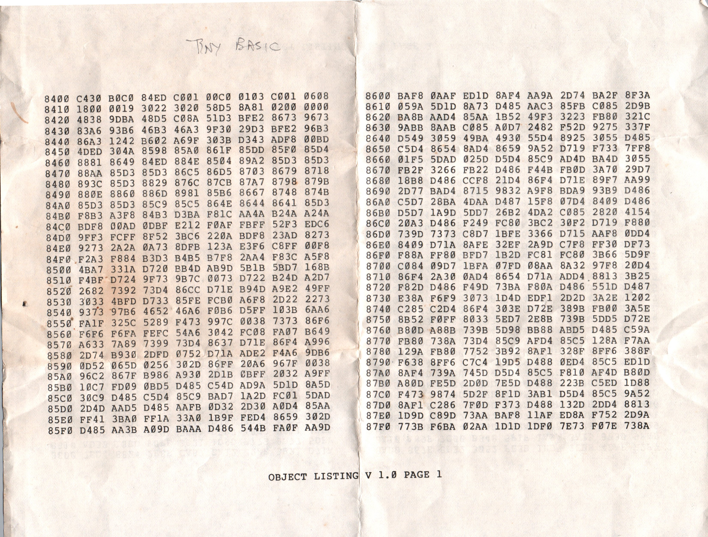
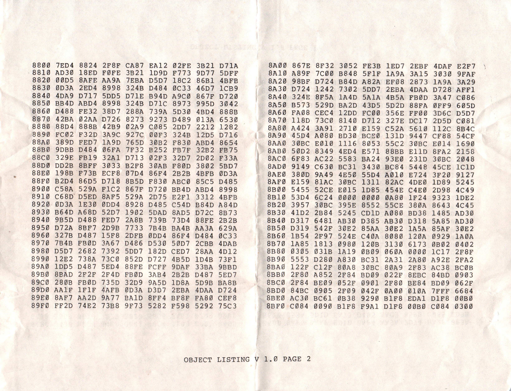

# 1802BASIC
1802 TinyBasic recovered from hard media

re-digitization of the TINYBASIC found by @MakeAugusta on twitter.
Please note that nto all files reflect the suspicious offset of 0x8400 in the address.
(It looks like the first 8kbits of ROM is missing?)

I have taken a first pass at decompiling it, 
 I used https://github.com/pahihu/rcatools as the disassembler. Some of the entry points are wrong,
 if replacing sections of disassembly, please do so carefully.

Pull requests open!
